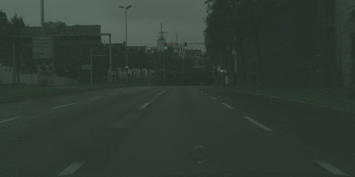

# Implementation of Google's Auto-Augmentation based on TF2 OPS

Exemplary implementation for learning augmentation policies from your training data distribution. The augmentation
operations rely on Tf2 operations which allows scalability and high computational throughput even on large images. 
Furthermore, the augmentation pipeline can be easily integrated into the tf.data API.

### Example for an augmentation policy
```python
augmentation_policy = {'sub_policy0': {'op0': ['adjust_saturation', 0.2, 2],
                                       'op1': ['equalize', 0.1, 6],
                                       'op2': ['add_noise', 0.9, 6]},
                       'sub_policy1': {'op0': ['adjust_contrast', 0.1, 7],
                                       'op1': ['add_noise', 0.0, 10]},
                       'sub_policy2': {'op0': ['posterize', 0.9, 6],
                                       'op1': ['unbiased_gamma_sampling', 0.5, 1]},
                       'sub_policy3': {'op0': ['adjust_brightness', 0.3, 1],
                                       'op1': ['adjust_hue', 0.4, 5]},
                       'sub_policy4': {'op0': ['adjust_saturation', 0.2, 9],
                                       'op1': ['add_noise', 0.1, 0]},
                       'sub_policy5': {'op0': ['adjust_contrast', 1.0, 1],
                                       'op1': ['unbiased_gamma_sampling', 0.4, 9]},
                       'sub_policy6': {'op0': ['unbiased_gamma_sampling', 0.3, 0],
                                       'op1': ['adjust_hue', 0.1, 6]},
                       'sub_policy7': {'op0': ['solarize', 0.6, 0],
                                       'op1': ['adjust_gamma', 0.3, 6]},
                       'sub_policy8': {'op0': ['adjust_jpeg_quality', 0.7, 10],
                                       'op1': ['adjust_hue', 0.1, 2]},
                       'sub_policy9': {'op0': ['equalize', 0.6, 0],
                                       'op1': ['solarize', 0.0, 6]}}
```
Similar to Google's AutoAugment, a single augmentation policy consists of several subpolicies, which inturn consists of one or more 
augmentation operation. Each operation is defined as a tuple of **augmentation method**, 
**probability** and **intensity**. Several operations within one subpolicy are applied in sequence. 
The augmentation policy from above would result in the following:
 


### Augmentation Methods
A list of all implemented augmentation techniques is given here. Additional, methods will be implemented in the near 
future. Performance is measured with the `test_image.jpg` which has size `2048 x 1024`. All augmentation methods are 
executed with `level=5`. Averaged over 500 samples on the Intel Core i7 Prozessor 8665U.

| Augmentation   |      Image      |   Performance (per Image)   |
|----------|:-------------|:-------------:|
| Additive Gaussian Noise |  | 0.05 s |
| Adjust Brightness |  | 0.02 s |
| Adjust Contrast |  | 0.03 s |
| Adjust Gamma |  | 0.04 s |
| Adjust Hue |  | 0.02 s |
| Adjust JPEG Quality |  | 0.05 s |
| Adjust Saturation |  | 0.02 s |
| Histogramm Equalization |  | 0.05 s |
| Invert |  | 0.02 s |
| Posterize |  | 0.02 s |
| Solarize |  | 0.03 s |
| Unbiased Gamma Sampling |  | 0.04 s |
| Gaussian Blur |  | 0.78 s |
| Sharpen |  | 0.13 s |
| Shear X |  | 0.06 s |
| Shear Y |  | 0.06 s |
| Translate X |  | 0.09 s |
| Translate Y |  | 0.09 s |

### TODO
- [ ] More Augmentation Methods
    - [X] Shear X
    - [X] Shear Y
    - [X] Translate X
    - [X] Translate Y
    - [ ] Random Translation
- [ ] Implement Learning Pipeline
- [ ] Implement augmentation policy search with Ray Tune
- [ ] Clean up Code (Unified Docstrings)
